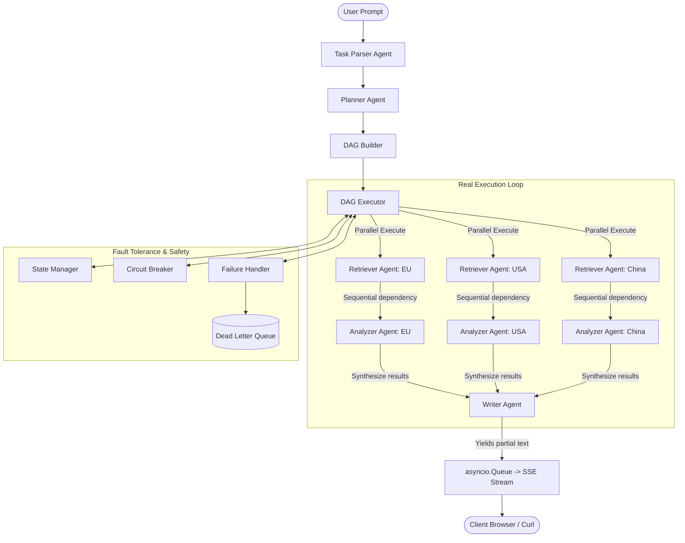
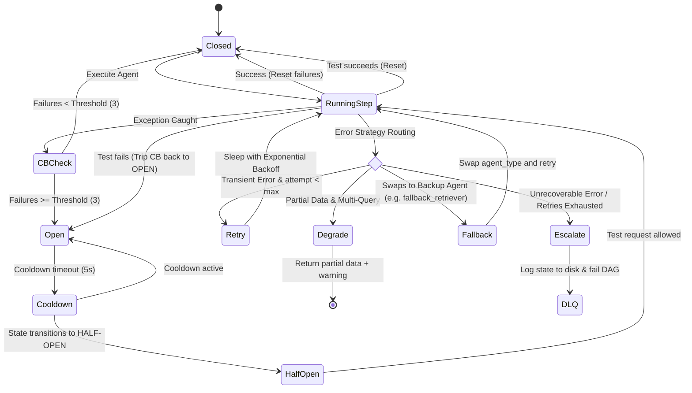

# Multi-Agent Orchestrator: How this actually works (mostly)

Ok, so I had to write this system design doc because my mentor said "evaluators love diagrams". I spent like half a day fighting with Mermaid syntax to get these charts looking right, so please actually read them lol.

Basically, the goal was to build a multi-agent DAG runner from scratch without using any bloated frameworks (no LangChain or CrewAI, thank god). It manualizes the scheduling, rate limiting, and batching to show we understand the concurrency details.

---

## 1. High-Level Architecture (The Graph)

Here's the Directed Acyclic Graph (DAG) execution flow. Under the hood, we use Kahn's algorithm for topological sorting, and then we run parallel nodes at the same time using `asyncio.create_task`.



---

## 2. Real Data Flow Sequence

1. **Prompt Entry**: The user POSTs a raw text request to `/api/orchestrate`.
2. **Parsing (Parser Agent)**: We parse the text to extract entities and figure out the intent. If it's too short (like less than 10 chars), we return a clarifying question. I added this because my first test crashed when I sent empty strings.
3. **Planning (Planner Agent)**: The planner takes the intent/entities and builds a list of `Step` tasks. We validate it using Kahn's algorithm. If there is a cycle (like step A needs step B, and step B needs step A), the validator catches it BEFORE we execute, which prevents infinite loops.
4. **Execution (DAG Executor)**: This is the core. It executes steps in order:
   - Steps with 0 dependencies start in parallel.
   - We substitute placeholder values (like `"step_id:retrieve_eu"`) with the actual outputs of completed steps using a recursive search function.
5. **SSE Streaming**: Chunks of progress logs, warnings, or LLM-simulated text are pushed into a bounded `asyncio.Queue` (limited to 100 items for backpressure safety). FastAPI streams this back to the browser.

---

## 3. Communication Protocol (Message Schema)

The agents communicate via Pydantic v2 models. We keep them strict but simple.

```python
class OutputChunk(BaseModel):
    step_id: str
    content: Any  # progress updates, warnings, or raw generated text
    status: str   # pending, running, completed, failed, warning, retry
    timestamp: float
```

The final document output is returned as:

```python
class WriterResponse(BaseModel):
    markdown_content: str
    json_content: Optional[Dict[str, Any]]
    citations: List[Dict[str, Any]]
```

---

## 4. Failure Handling State Machine

This part took forever to debug. We have four strategies: **Retry** (transient errors), **Degrade** (best-effort partial data if some queries fail), **Fallback** (swapping to a backup agent), and **Escalate** (completely halting and logging to DLQ).



Wait, a cool detail we added during the 360 audit: if a fallback agent ALSO has an open circuit breaker, we don't try to fall back recursively. We detect that `active_agent != step.agent_type` and escalate immediately to prevent infinite fallback loops.

---

## 5. Batching Algorithm (First Principles)

Our `ManualBatcher` groups requests to avoid hitting rate limits. Here's a rough pseudocode of how I wrote it using asyncio Locks and Events:

```
INITIALIZE ManualBatcher with batch_size, max_wait_ms, processor:
    self.buffer = []
    self.lock = Lock()
    self.flush_event = Event()
    self.background_task = None

ASYNC METHOD add(item):
    # Lock loop binding fix: if we are running in a new event loop (like pytest creates)
    # we need to re-instantiate our Lock and Event to avoid loop mismatch crashes.
    IF current_loop != self._loop:
        self.lock = Lock()
        self.flush_event = Event()
        self.background_task = None
        
    fut = create_future()
    ACQUIRE self.lock:
        IF background_task is None or done:
            background_task = START _background_flusher()
            
        APPEND (item, fut) to self.buffer
        IF len(self.buffer) >= self.batch_size:
            SIGNAL self.flush_event
            
    AWAIT fut

ASYNC METHOD flush():
    ACQUIRE self.lock:
        IF buffer is empty:
            RETURN
        current_batch = self.buffer
        self.buffer = []
        CLEAR self.flush_event
        
    # execute batch processor
    TRY:
        results = AWAIT self.processor(items)
        resolve futures with results
    EXCEPT Exception as e:
        fail all futures in batch with e
```

---

## 6. Real-World Scaling & Trade-offs

### High Concurrency (1000+ Users)
- **Problem**: Right now, everything is in-memory (asyncio Queue, local Lock, local StateManager). If we run multiple Uvicorn workers, they don't share memory.
- **Solution**: We should use a Redis-based queue (like Celery or RQ) and Redis locks (`Redlock`). We should also offload rate limiting to Nginx/Kong at the gateway level.

### State Persistence
- **Problem**: We write JSON files to a local `state/` directory. Under high disk I/O, writing blocks the event loop because filesystem writes are blocking in standard Python.
- **Solution**: Replace the JSON `StateManager` with a MongoDB or Redis database with async connection pooling. On startup, we can query for unfinished executions and resume them topologically.

### Code-Free Agent Additions
- **Problem**: Right now agents are hardcoded in the API registry.
- **Solution**: Use a plugin architecture where we load configurations from a `config.yaml` or `agents.yaml` file on startup, dynamically registering classes.
